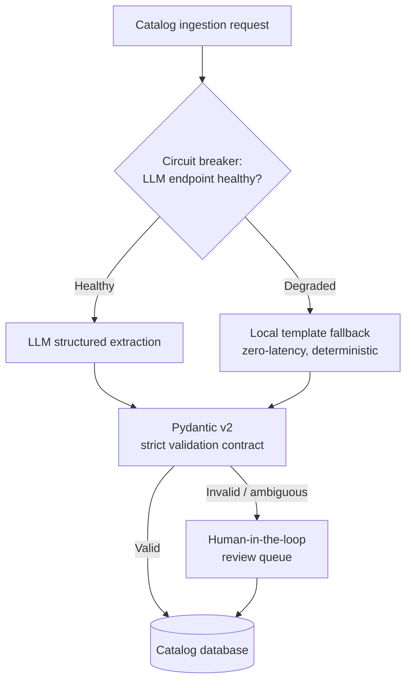
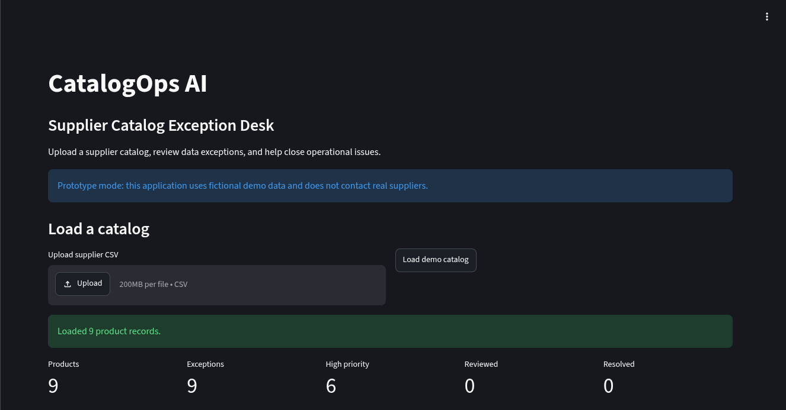
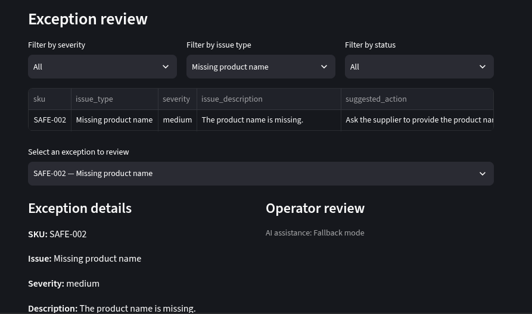
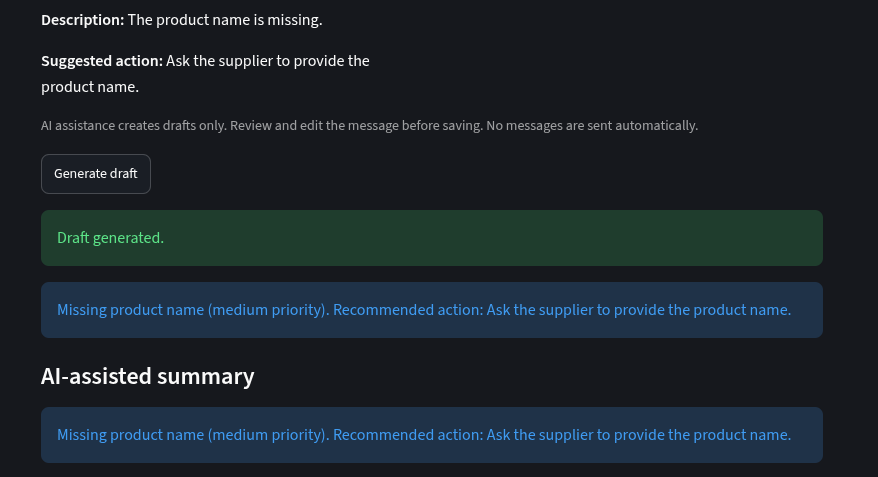
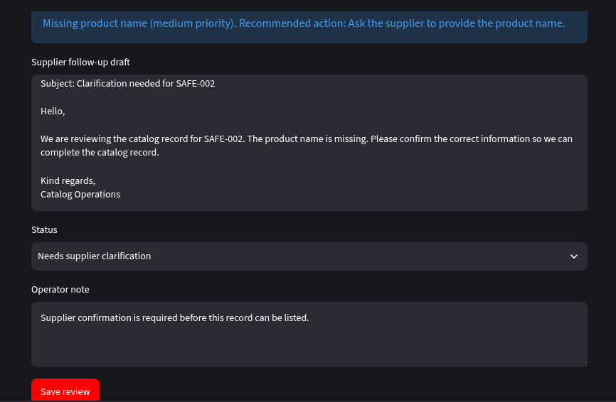
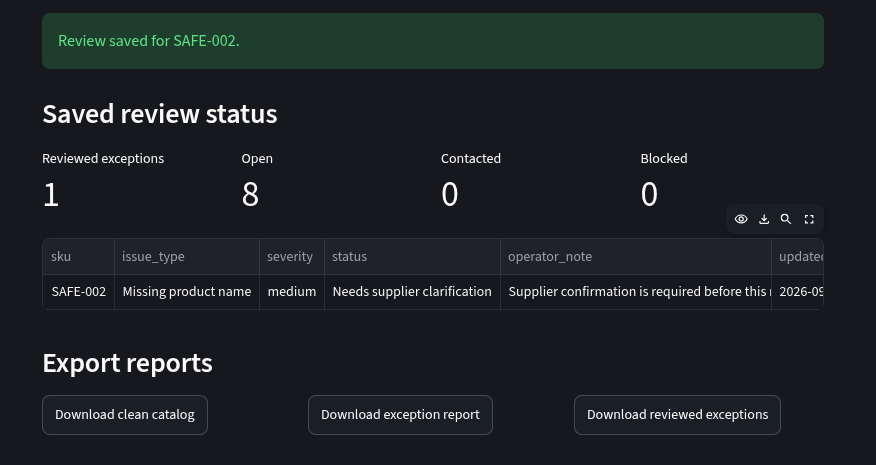
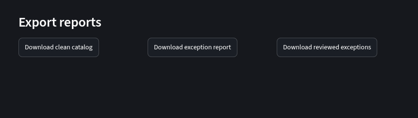

# CatalogOps AI 🚀

An enterprise-grade, human-in-the-loop AI operations desk designed to streamline supplier catalog ingestion, automatically flags exceptions, and generates contextual vendor communications at scale.

## 💡 The Problem & Solution
E-commerce supplier catalogs frequently arrive corrupted with missing metadata, duplicate SKUs, invalid price ranges, and formatting anomalies. This tool pairs deterministic data-validation pipelines with LLM-orchestrated reasoning to let operations managers audit thousands of catalog items in seconds.

## 🛠️ System Architecture & AI Pattern


### Key Engineering Features
* **Human-in-the-Loop Orchestration:** Combines strict backend constraints with LLMs, ensuring no automated communication is dispatched without internal operator approval.
* **Deterministic Exception Filter:** Leverages an optimized Pandas data processing layer to execute lightning-fast validation passes on massive datasets before piping contextual exceptions to the AI layer.
* **Production AI Architecture:** Architected using a clean service-oriented module layout (`services/ai_assistant.py`), cleanly isolating the core application logic from the LLM endpoint provider layer.
* **Resilient Fallback Handling:** Engineered with a specialized failover layer ensuring consistent operational desktop uptime even during third-party LLM service degradation or API rate-limiting thresholds.

## 🧰 Tech Stack
* **Core Systems:** Python, Pandas, Streamlit UI
* **Testing & Quality:** Pytest (Unit testing data-validation rules)
* **Architecture:** Service-Oriented Architecture (SOA), Asynchronous State Management

## 📂 Project Structure
```text
catalogops-ai/
├── app.py                  # Main Streamlit Operational Dashboard
├── README.md               # System Documentation
├── DECISIONS.md            # Architecture & Engineering Log
├── requirements.txt        # System Dependencies
├── services/
│   ├── ai_assistant.py     # LLM Prompts & Contextual Drafting Layer
│   ├── validation_rules.py # Deterministic Data Audit Logic
│   └── validator.py        # Pipeline Ingestion Engine
└── tests/
    └── test_validator.py   # Automated Regression Testing
```

## 📈 System Limitations & Future Roadmaps
* **State Management:** Currently utilizing Streamlit session state; migration to a distributed state layer (Redis/PostgreSQL) is planned for multi-operator environments.
* **Async Scaling:** Moving the file ingestion framework toward a background processing worker queue to scale past massive chunk boundaries seamlessly.


## Demo

[Open the live demo](https://myd65hutt9yzrhalht8ob2.streamlit.app/)

## Screenshots

### Dashboard



### Exception review





### Saved review

### Exports



```
